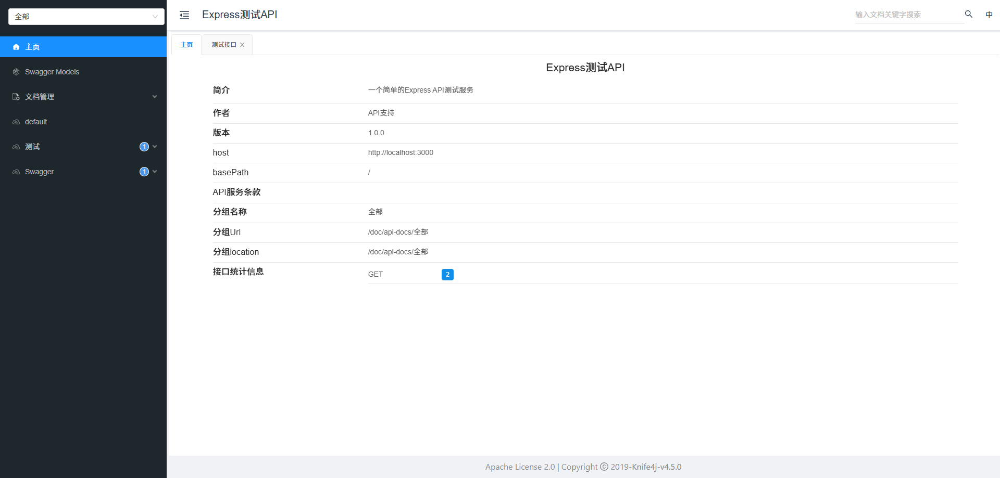
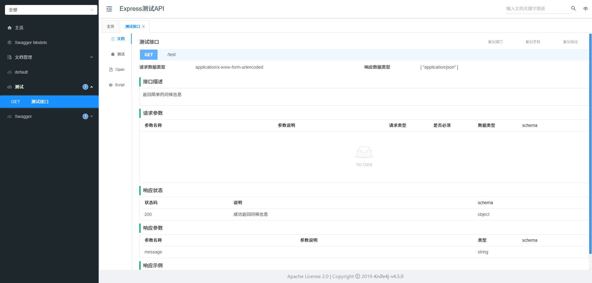

# node-knife4j-ui

> 一个用于在Node.js应用中集成Knife4j UI界面的中间件，可以方便地展示Swagger/OpenAPI文档。对 CommonJS 和 ES Modules 的双重支持。

## 特性

- 🚀 零依赖，轻量级中间件
- 📚 支持Swagger/OpenAPI 3.0规范
- 🎯 自动API分组显示
- 🔧 灵活的配置选项
- 📱 响应式UI设计

## 安装

```bash
npm install node-knife4j-ui
```


## 示例图片







## 引入方式

### CommonJS

```javascript
const { Knife4jDoc } = require('node-knife4j-ui');
const knife4jDoc = new Knife4jDoc(swaggerSpec);
// 或者
const Knife4jDoc = require('node-knife4j-ui').default;
const knife4jDoc = new Knife4jDoc(swaggerSpec);
```


### ES Modules

```javascript
import Knife4jDoc from 'node-knife4j-ui';
const knife4jDoc = new Knife4jDoc(swaggerSpec);
// 或者
import { Knife4jDoc } from 'node-knife4j-ui';
const knife4jDoc = new Knife4jDoc(swaggerSpec);
```


## 快速开始

### 注意事项

> 这个包使用中间件的方式写的接口，个人接口不能和这个包内部的中间件的判断冲突，否则不能正常使用

```javascript
// 1.0.6之前
req.url.endsWith("/v3/api-docs/swagger-config")
req.url.endsWith("/swagger-resources")
req.url.startsWith("/api-docs/")
// 1.0.6之后
```


### express版本使用

> 个人测试node版本16

```javascript
import express from 'express';
import swaggerJsdoc from 'swagger-jsdoc';
import swaggerUi from 'swagger-ui-express';
import Knife4jDoc from 'node-knife4j-ui';

const app = express();
const PORT = process.env.PORT || 3000;

// 中间件
app.use(express.json());
app.use(express.urlencoded({ extended: true }));

// Swagger配置选项
const swaggerOptions = {
  definition: {
    openapi: '3.0.0',
    info: {
      title: 'Express测试API',
      version: '1.0.0',
      description: '一个简单的Express API测试服务',
      contact: {
        name: 'API支持',
        email: 'support@example.com'
      }
    },
    servers: [
      {
        url: `http://localhost:${PORT}`,
        description: '开发服务器'
      }
    ]
  },
  apis: ['./app.js'] // 指定包含JSDoc注释的文件
};

// 生成Swagger规范
const swaggerSpec = swaggerJsdoc(swaggerOptions);

// 提供Swagger UI
app.use('/swagger', swaggerUi.serve, swaggerUi.setup(swaggerSpec));
// 提供 Knife4j 文档
const knife4jDoc = new Knife4jDoc(swaggerSpec);
const knife4jDocPath = knife4jDoc.getKnife4jUiPath();
// 暴露静态文件服务
app.use('/doc', knife4jDoc.serveExpress('/doc'), express.static(knife4jDocPath));

/**
 * @swagger
 * /test:
 *   get:
 *     summary: 测试接口
 *     description: 返回简单的问候信息
 *     tags:
 *       - 测试
 *     responses:
 *       200:
 *         description: 成功返回问候信息
 *         content:
 *           application/json:
 *             schema:
 *               type: object
 *               properties:
 *                 message:
 *                   type: string
 *                   example: 你好！
 */
app.get('/test', (req, res) => {
  res.json({ message: '你好！' });
});

/**
 * @swagger
 * /getSwaggerSpec:
 *   get:
 *     summary: 获取Swagger规范
 *     description: 返回完整的Swagger规范对象
 *     tags:
 *       - Swagger
 *     responses:
 *       200:
 *         description: 成功返回Swagger规范
 *         content:
 *           application/json:
 *             schema:
 *               type: object
 *               properties:
 *                 swaggerSpec:
 *                   type: object
 *                   description: Swagger规范对象
 */
app.get('/getSwaggerSpec', (req, res) => {
  res.json({ swaggerSpec });
});

// 启动服务器
app.listen(PORT, () => {
  console.log(`服务器运行在 http://localhost:${PORT}`);
  console.log(`Swagger文档地址: http://localhost:${PORT}/swagger`);
  console.log(`Knife4j文档地址: http://localhost:${PORT}/doc`);
});

export default app;
```


### koa版本使用

> 个人测试node版本20，koa静态文件得使用18+才能正常使用
>
> koa暴露静态文件不会自动拼接前缀，axios也没有自动拼接前缀写法有一点点不同

```javascript
import Koa from 'koa';
import Router from 'koa-router';
import bodyParser from 'koa-bodyparser';
import cors from '@koa/cors';
import swaggerJsdoc from 'swagger-jsdoc';
import koaSwagger from 'koa2-swagger-ui';
import Knife4jDoc from 'node-knife4j-ui';
import serve from 'koa-static';
import mount from 'koa-mount';


const app = new Koa();
const router = new Router();
const PORT = process.env.PORT || 3001;

// 中间件
app.use(cors());
app.use(bodyParser());

// Swagger配置选项
const swaggerOptions = {
  definition: {
    openapi: '3.0.0',
    info: {
      title: 'Koa测试API',
      version: '1.0.0',
      description: '一个简单的Koa API测试服务',
      contact: {
        name: 'API支持',
        email: 'support@example.com'
      }
    },
    servers: [
      {
        url: `http://localhost:${PORT}`,
        description: '开发服务器'
      }
    ]
  },
  apis: ['./koa-app.js'] // 指定包含JSDoc注释的文件
};

// 生成Swagger规范
const swaggerSpec = swaggerJsdoc(swaggerOptions);

// 提供Swagger UI
const swaggerUi = koaSwagger.koaSwagger({
  routePrefix: '/swagger',
  swaggerOptions: {
    spec: swaggerSpec
  },
});

// 提供 Knife4j 文档
const knife4jDoc = new Knife4jDoc(swaggerSpec);
const knife4jDocPath = knife4jDoc.getKnife4jUiPath();
// koa没有自动拼接前缀，不用转请求接口的前缀
app.use(knife4jDoc.serveKoa());
// 暴露静态文件服务，没有拼接前缀，需要将静态文件分开弄
app.use(mount('/doc', serve(knife4jDocPath, { index: 'index.html' })));
app.use(serve(knife4jDocPath))


/**
 * @swagger
 * /test:
 *   get:
 *     summary: 测试接口
 *     description: 返回简单的问候信息
 *     tags:
 *       - 测试
 *     responses:
 *       200:
 *         description: 成功返回问候信息
 *         content:
 *           application/json:
 *             schema:
 *               type: object
 *               properties:
 *                 message:
 *                   type: string
 *                   example: 你好！
 */
router.get('/test', (ctx) => {
  ctx.body = { message: '你好！' };
});

/**
 * @swagger
 * /getSwaggerSpec:
 *   get:
 *     summary: 获取Swagger规范
 *     description: 返回完整的Swagger规范对象
 *     tags:
 *       - Swagger
 *     responses:
 *       200:
 *         description: 成功返回Swagger规范
 *         content:
 *           application/json:
 *             schema:
 *               type: object
 *               properties:
 *                 swaggerSpec:
 *                   type: object
 *                   description: Swagger规范对象
 */
router.get('/getSwaggerSpec', (ctx) => {
  ctx.body = { swaggerSpec };
});

// 应用路由
app.use(router.routes());
app.use(router.allowedMethods());

// 应用Swagger UI
app.use(swaggerUi);

// 启动服务器
app.listen(PORT, () => {
  console.log(`Koa服务器运行在 http://localhost:${PORT}`);
  console.log(`Swagger文档地址: http://localhost:${PORT}/swagger`);
  console.log(`Knife4j文档地址: http://localhost:${PORT}/doc`);
});

export default app;
```


### nestjs使用

> 得按照自己使用的底层框架使用，下面是express作为底层框架的核心代码

```typescript
import { SwaggerModule } from "@nestjs/swagger";
import Knife4jDoc from "node-knife4j-ui";
import * as express from "express";

// 创建 Swagger 文档
const document = SwaggerModule.createDocument(app, SwaggerConfig.swaggerOptions);
const knife4jDoc = new Knife4jDoc(document);
const knife4jDocPath = knife4jDoc.getKnife4jUiPath();
// 暴露静态文件服务
app.use("/test", knife4jDoc.serveExpress("/test"), express.static(knife4jDocPath));
```

